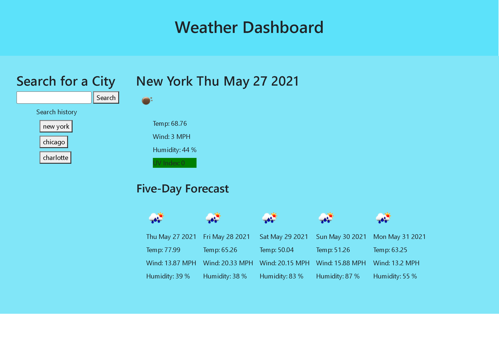

# Weather Dashboard
## Contents
1. [About](#About)
2. [Description](#Description)
3. [Screenshot](#Screenshot)
4. [Contact-Info](#Contact-Info)
3. [License](#License)

## About
Application prompts user to search for a city on the side search bar. Once submitted, the main portion of the screen will load out the current weather for said location with color coded UV Index. It will also display a 5-day outlook. The application will also save recent searches.

## Description
[Deployed Application](https://amgaudet.github.io/weather-dashboard/)
On load, application checks local storage for recent searches and creates a drop down button list of any searches stored in local storage. The application then fetches weather conditions from the openweathermap API. Weather conditions are then populated with a list of details. Any searches after will clear the screen and reload with the new city searched. The user can also click on any of the recent search buttons to re-do a search on a saved city.

## Screenshot

## Contact-Info

Alan Gaudet - <alanmgaudet@gmail.com>

Portfolio - <https://github.com/amgaudet>

## License

MIT License

Copyright (c) 2021 Alan Gaudet

Permission is hereby granted, free of charge, to any person obtaining a copy
of this software and associated documentation files (the "Software"), to deal
in the Software without restriction, including without limitation the rights
to use, copy, modify, merge, publish, distribute, sublicense, and/or sell
copies of the Software, and to permit persons to whom the Software is
furnished to do so, subject to the following conditions:

The above copyright notice and this permission notice shall be included in all
copies or substantial portions of the Software.

THE SOFTWARE IS PROVIDED "AS IS", WITHOUT WARRANTY OF ANY KIND, EXPRESS OR
IMPLIED, INCLUDING BUT NOT LIMITED TO THE WARRANTIES OF MERCHANTABILITY,
FITNESS FOR A PARTICULAR PURPOSE AND NONINFRINGEMENT. IN NO EVENT SHALL THE
AUTHORS OR COPYRIGHT HOLDERS BE LIABLE FOR ANY CLAIM, DAMAGES OR OTHER
LIABILITY, WHETHER IN AN ACTION OF CONTRACT, TORT OR OTHERWISE, ARISING FROM,
OUT OF OR IN CONNECTION WITH THE SOFTWARE OR THE USE OR OTHER DEALINGS IN THE
SOFTWARE.